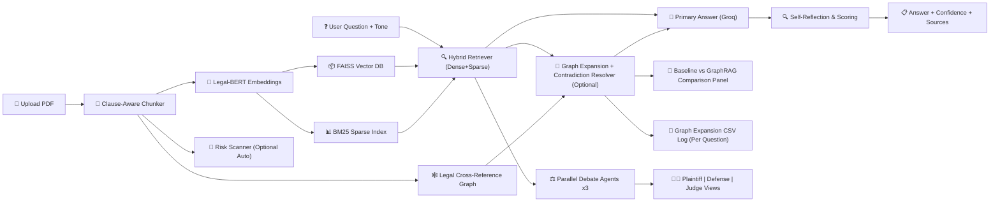

# Vertisa AI


An advanced Retrieval-Augmented Generation (RAG) system engineered specifically for legal documents. Vertisa AI enables lawyers, students, and businesses to upload complex legal PDFs (contracts, privacy policies, merger agreements) and ask plain English questions to receive precise, cited answers backed by confidence scoring, risk scanning, reference-aware GraphRAG, retrieval comparison visualizations, and multi-agent legal debate.

---

## Key Features & Enhancements

This project significantly improves upon standard RAG pipelines by introducing production-focused enhancements tailored for the legal domain:

1. **Clause-Aware Adaptive Chunking** 🔪
   Standard RAG systems split text arbitrarily (e.g., every 512 tokens), which often breaks legal clauses in half. Vertisa AI uses regex-based boundary detection (`SECTION`, `ARTICLE`, `WHEREAS`) to assure each vector chunk contains one complete, unbroken legal thought.
2. **Hybrid Dense + Sparse Retrieval** 🔍
   Combines semantic search via `Legal-BERT` (FAISS) with exact keyword matching (`BM25`) at a 60/40 weight ratio to ensure both conceptual and exact-text retrieval.
3. **Confidence-Scored Self-Reflection** 🧠
   Instead of blindly returning an LLM answer, the system performs a second reflection pass that outputs confidence and hallucination risk flags.
4. **Tone Adjuster (ELI5 / Standard / Legalese)** 🎛️
   Users can choose response style before generation while keeping retrieval behavior unchanged.
5. **Automatic Red-Flag Risk Scanner** 🚨
   After indexing, Vertisa AI can scan the uploaded legal text and return up to three concise risk alerts (with optional manual mode to save tokens).
6. **Reference-Aware Recursive GraphRAG (Multi-Hop Legal Resolver)** 🕸️
   Builds a legal cross-reference graph during indexing by detecting clause identities and references (`notwithstanding`, `subject to`, `pursuant to`). At question time, retrieval is expanded across graph links so exception clauses are pulled in before answer generation.
7. **Baseline vs GraphRAG Retrieval Comparison Panel** 🧪
   For each GraphRAG-enabled question, the UI renders side-by-side baseline Top-K clauses versus graph-expanded clauses so exception retrieval gains are presentation-ready for papers and demos.
8. **GraphRAG Expansion CSV Logging (Per Question)** 🧾
   Every answered question appends operational GraphRAG metrics to `results/graphrag_expansion_log.csv` including hops requested, extra clauses added, override detection, graph trigger events, and confidence.
9. **Multi-Agent Legal Debate (Plaintiff vs Defense vs Judge)** ⚖️
   The app launches three concurrent Groq calls on the same retrieved context and displays opposing legal interpretations side-by-side.
10. **Broad Generalizability** 📈
   Evaluated not just on one dataset, but across three distinct legal domains: CUAD (commercial contracts), MAUD (merger agreements), and PrivacyQA (app privacy policies).

---

## System Architecture



---

## Repository Structure

```text
.
├── app.py                  # Streamlit web interface and core RAG logic
├── f1.py                   # Multi-agent legal debate engine (3 concurrent Groq calls)
├── f2.py                   # Reference-aware recursive GraphRAG engine (legal cross-reference graph)
├── requirements.txt        # Python dependency manifest
├── README.md               # Project documentation
├── notebooks/
│   └── Vertisa_AI.ipynb    # Core research, pipeline evaluation, and benchmarking
├── results/                # Evaluation output CSVs + GraphRAG runtime metrics logs
├── graphs/                 # ROUGE/METEOR/BLEU benchmarking visualizations
└── docs/                   # Additional documentation and assets
```

---

## Installation & Setup

### Prerequisites

- Python 3.9 or higher
- A free API key from [Groq Console](https://console.groq.com)

### Local Environment Setup

1. Clone the repository and navigate to the root directory.
2. Install the required dependencies:
   ```bash
   pip install -r requirements.txt
   ```

### Running the Application

Launch the interactive Streamlit dashboard:

```bash
streamlit run app.py
```

1. Open the provided `localhost` URL in your browser.
2. Enter your Groq API Key in the sidebar configuration.
3. Upload a legal PDF.
4. Optionally disable auto red-flag scanning if you want manual scan mode.
5. Pick an answer tone (ELI5, Standard, or Strict Legalese).
6. Optionally enable GraphRAG Cross-Reference Resolver (recommended for complex contracts).
7. Ask your legal question.
8. Review the Baseline vs GraphRAG comparison panel generated for GraphRAG-enabled runs.
9. Check `results/graphrag_expansion_log.csv` for per-question GraphRAG metrics.
10. Optionally enable Multi-Agent Legal Debate for side-by-side legal perspectives.

---

## Evaluation & Benchmarking (Notebook)

The quantitative evaluation pipeline is contained within `notebooks/Vertisa_AI.ipynb`. It compares our **Clause-Aware Method** against the **Original Fixed-Size Baseline** using ROUGE-1, ROUGE-2, ROUGE-L, METEOR, and BLEU metrics.

**To run the benchmarks:**

1. Upload `notebooks/Vertisa_AI.ipynb` to Google Colab.
2. Navigate to the left sidebar in Colab → **🔑 Secrets** → Add a new secret named `GROQ_API_KEY` with your API value.
3. Select **Runtime** > **Run all**.
4. The benchmarking cell will take approximately 15-20 minutes, factoring in the necessary API rate limits.
5. Once complete, updated visualizations and CSV reports will be generated automatically.

---

_Built for the intersection of Law and Artificial Intelligence._
