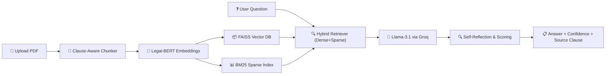

# Vertisa AI


An advanced Retrieval-Augmented Generation (RAG) system engineered specifically for legal documents. Vertisa AI enables lawyers, students, and businesses to upload complex legal PDFs (contracts, privacy policies, merger agreements) and ask plain English questions to receive precise, cited answers backed by confidence scoring.

---

## Key Features & Enhancements

This project significantly improves upon standard RAG pipelines by introducing four major enhancements tailored for the legal domain:

1. **Clause-Aware Adaptive Chunking** 🔪
   Standard RAG systems split text arbitrarily (e.g., every 512 tokens), which often breaks legal clauses in half. Vertisa AI uses regex-based boundary detection (`SECTION`, `ARTICLE`, `WHEREAS`) to assure each vector chunk contains one complete, unbroken legal thought.
2. **Confidence-Scored Self-Reflection** 🧠
   Instead of blindly returning an LLM answer, the system employs a secondary reflection step. The model rates its own grounding (0-100%). If confidence falls below 60%, the system automatically refines the query and searches again, drastically reducing legal hallucinations.
3. **Hybrid Dense + Sparse Retrieval** 🔍
   Combines semantic search via `Legal-BERT` (FAISS) with exact keyword matching (`BM25`) at a 60/40 weight ratio to ensure both conceptual and exact-text retrieval.
4. **Broad Generalizability** 📈
   Evaluated not just on one dataset, but across three distinct legal domains: CUAD (commercial contracts), MAUD (merger agreements), and PrivacyQA (app privacy policies).

---

## System Architecture



---

## Repository Structure

```text
.
├── app.py                  # Streamlit web interface and core RAG logic
├── requirements.txt        # Python dependency manifest
├── README.md               # Project documentation
├── notebooks/
│   └── Vertisa AI_RAG.ipynb # Core research, pipeline evaluation, and benchmarking
├── results/                # Evaluation output CSVs (Clause vs Fixed methods)
├── graphs/                 # ROUGE/METEOR/BLEU benchmarking visualizations
└── docs/                   # Additional documentation and assets
```

---

## Installation & Setup

### Prerequisites

- Python 3.9 or higher
- A free API key from [Groq Console](https://console.groq.com)

### Local Environment Setup

1. Clone the repository and navigate to the root directory.
2. Install the required dependencies:
   ```bash
   pip install -r requirements.txt
   ```

### Running the Application

Launch the interactive Streamlit dashboard:

```bash
streamlit run app.py
```

1. Open the provided `localhost` URL in your browser.
2. Enter your Groq API Key in the sidebar configuration.
3. Upload a legal PDF.
4. Start asking questions!

---

## Evaluation & Benchmarking (Notebook)

The quantitative evaluation pipeline is contained within `notebooks/Vertisa AI_RAG.ipynb`. It compares our **Clause-Aware Method** against the **Original Fixed-Size Baseline** using ROUGE-1, ROUGE-2, ROUGE-L, METEOR, and BLEU metrics.

**To run the benchmarks:**

1. Upload `notebooks/Vertisa AI_RAG.ipynb` to Google Colab.
2. Navigate to the left sidebar in Colab → **🔑 Secrets** → Add a new secret named `GROQ_API_KEY` with your API value.
3. Select **Runtime** > **Run all**.
4. The benchmarking cell will take approximately 15-20 minutes, factoring in the necessary API rate limits.
5. Once complete, updated visualizations and CSV reports will be generated automatically.

---

_Built for the intersection of Law and Artificial Intelligence._
